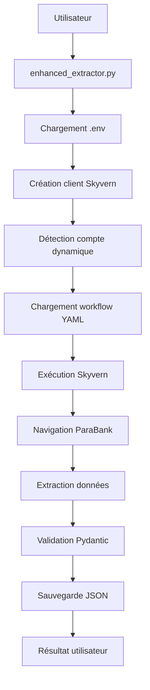

# 🔧 Guide Technique Détaillé

## 🏗️ Architecture du Système

### 📋 Vue d'ensemble de l'Architecture

```
┌─────────────────────────────────────────────────────────────┐
│                    AI Banking POC                           │
├─────────────────────────────────────────────────────────────┤
│  Frontend (Python Scripts)                                 │
│  ├── simple_test.py           (Tests rapides)              │
│  ├── enhanced_extractor.py    (Extraction principale)      │
│  └── test_dynamic_detection.py (Tests automatiques)        │
├─────────────────────────────────────────────────────────────┤
│  Business Logic                                            │
│  ├── EnhancedBankExtractor    (Logique métier)             │
│  ├── Account Detection        (Détection dynamique)        │
│  └── Data Processing          (Traitement données)         │
├─────────────────────────────────────────────────────────────┤
│  Data Layer                                               │
│  ├── Pydantic Schemas        (Validation)                  │
│  ├── JSON Outputs            (Persistance)                 │
│  └── YAML Workflows          (Configuration)               │
├─────────────────────────────────────────────────────────────┤
│  External Services                                         │
│  ├── Skyvern API             (Automatisation IA)           │
│  ├── ParaBank Website        (Source de données)           │
│  └── OpenAI API              (LLM pour Skyvern)            │
└─────────────────────────────────────────────────────────────┘
```

### 🔄 Flux de Données



## 🧠 Composants Techniques

### 1. **EnhancedBankExtractor** (Composant Principal)

```python
class EnhancedBankExtractor:
    """
    Composant principal d'extraction bancaire
    
    Responsabilités:
    - Gestion de l'API Skyvern
    - Détection dynamique des comptes
    - Traitement des résultats
    - Gestion des erreurs
    """
    
    # Méthodes principales
    async def extract_account_details_and_transactions(target_account=None)
    async def _get_first_available_account()
    async def _process_enhanced_results()
    async def extract_multiple_accounts()
```

### 2. **Workflow YAML** (Configuration Skyvern)

```yaml
# Structure du workflow enhanced_bank_extraction.yaml
title: Enhanced Bank Data Extraction
workflow_definition:
  parameters:           # Paramètres d'entrée
    - TARGET_URL
    - USERNAME  
    - PASSWORD
    - TARGET_ACCOUNT   # Optionnel - détection auto si vide
  
  blocks:              # Étapes d'exécution
    - Login_To_Bank                    # Connexion
    - Extract_First_Account_Details    # Détails compte
    - Extract_Account_Transactions     # Transactions
    - Return_To_Overview_For_Next_Account  # Navigation retour
```

### 3. **Schémas Pydantic** (Validation)

```python
# utils/schemas.py
class Account(BaseModel):
    account_id: str
    account_type: Optional[str]
    balance: Optional[float]
    # ... autres champs

class Transaction(BaseModel):
    account_id: str
    date: Optional[str]
    amount: Optional[float]
    # ... autres champs
```

## 🔍 Algorithmes Clés

### 1. **Détection Dynamique des Comptes**

```python
async def _get_first_available_account(self) -> str:
    """
    Algorithme de détection dynamique:
    
    1. Essayer extraction rapide via simple_test
    2. Parser les résultats pour obtenir liste comptes
    3. Retourner le premier compte trouvé
    4. En cas d'échec: fallback avec liste prédéfinie
    5. Logging détaillé à chaque étape
    """
    
    # Étape 1: Tentative API
    try:
        result = await simple_tester.test_simple_extraction()
        accounts = parse_accounts_from_result(result)
        return accounts[0] if accounts else fallback()
    
    # Étape 2: Fallback intelligent
    except Exception:
        return fallback_strategy()
```

### 2. **Gestion des Erreurs avec Fallback**

```python
# Stratégie de fallback multi-niveaux
FALLBACK_ACCOUNTS = ["12345", "12456", "12567", "12678"]

def get_fallback_account():
    """
    Fallback intelligent:
    - Essaie plusieurs comptes connus
    - Logs pour traçabilité
    - Retourne le premier qui pourrait fonctionner
    """
    for account in FALLBACK_ACCOUNTS:
        log.info(f"Trying fallback account: {account}")
        return account  # Premier dans la liste
```

### 3. **Traitement Asynchrone**

```python
# Pattern d'exécution asynchrone
async def extract_multiple_accounts(accounts: List[str]):
    """
    Traitement parallèle avec contrôle:
    - Limite de concurrence
    - Délais entre requêtes
    - Gestion erreurs individuelles
    - Agrégation des résultats
    """
    
    results = {}
    for account in accounts:
        try:
            result = await extract_single_account(account)
            results[account] = result
            await asyncio.sleep(30)  # Respect des limites API
        except Exception as e:
            results[account] = {"error": str(e)}
    
    return aggregate_results(results)
```

## 🚀 Optimisations Techniques

### 1. **Gestion Mémoire**

```python
# Utilisation de générateurs pour gros volumes
def process_transactions_stream(transactions):
    """Traitement en streaming pour éviter surcharge mémoire"""
    for transaction in transactions:
        yield normalize_transaction(transaction)

# Cleanup automatique
async def __aenter__(self):
    return self

async def __aexit__(self, exc_type, exc_val, exc_tb):
    await self.cleanup_resources()
```

### 2. **Cache et Performance**

```python
# Cache des résultats d'API
from functools import lru_cache

@lru_cache(maxsize=100)
def get_account_schema():
    """Cache des schémas pour éviter recompilation"""
    return load_pydantic_schema()

# Timeout adaptatifs
TIMEOUTS = {
    "simple_test": 300,      # 5 minutes
    "enhanced": 600,         # 10 minutes  
    "multi_account": 1200    # 20 minutes
}
```

### 3. **Monitoring et Logging**

```python
import logging
from datetime import datetime

# Configuration logging structuré
logging.basicConfig(
    level=logging.INFO,
    format='%(asctime)s - %(name)s - %(levelname)s - %(message)s',
    handlers=[
        logging.FileHandler('banking_extraction.log'),
        logging.StreamHandler()
    ]
)

# Métriques de performance
class PerformanceMonitor:
    def __init__(self):
        self.start_time = datetime.now()
        self.metrics = {}
    
    def track_operation(self, operation_name):
        """Tracking temps d'exécution par opération"""
        start = datetime.now()
        # ... opération ...
        duration = datetime.now() - start
        self.metrics[operation_name] = duration
```

## 🔐 Sécurité et Bonnes Pratiques

### 1. **Gestion des Secrets**

```python
# .env - Variables sensibles
SKYVERN_API_KEY='...'  # Jamais dans le code source
OPENAI_API_KEY='...'   # Chargement via python-dotenv

# Validation des clés
def validate_api_key(api_key: str) -> bool:
    """Validation format JWT"""
    return api_key.startswith('eyJ') and len(api_key) > 100
```

### 2. **Validation des Données**

```python
# Validation stricte avec Pydantic
class TransactionSchema(BaseModel):
    amount: confloat(gt=-1000000, lt=1000000)  # Limites réalistes
    date: constr(regex=r'\d{2}-\d{2}-\d{4}')   # Format date strict
    account_id: constr(min_length=5, max_length=10)  # Longueur compte
    
    @validator('amount')
    def validate_amount(cls, v):
        """Validation métier des montants"""
        if v == 0:
            raise ValueError('Amount cannot be zero')
        return v
```

### 3. **Gestion des Limites d'API**

```python
# Rate limiting
from asyncio import Semaphore

class APIRateLimiter:
    def __init__(self, max_concurrent=3):
        self.semaphore = Semaphore(max_concurrent)
    
    async def __aenter__(self):
        await self.semaphore.acquire()
        return self
    
    async def __aexit__(self, exc_type, exc_val, exc_tb):
        self.semaphore.release()

# Usage
async with APIRateLimiter():
    result = await skyvern_api_call()
```

## 📊 Monitoring et Métriques

### 1. **KPIs Techniques**

```python
# Métriques clés à surveiller
METRICS = {
    'extraction_success_rate': 0.95,    # 95% de réussite
    'avg_extraction_time': 300,         # 5 minutes moyenne
    'api_error_rate': 0.05,             # 5% d'erreurs max
    'data_quality_score': 0.98          # 98% de données valides
}

class MetricsCollector:
    def __init__(self):
        self.metrics = defaultdict(list)
    
    def record_extraction(self, duration, success, errors):
        """Enregistrement métriques par extraction"""
        self.metrics['durations'].append(duration)
        self.metrics['successes'].append(success)
        self.metrics['errors'].extend(errors)
    
    def get_summary(self):
        """Calcul KPIs agrégés"""
        return {
            'avg_duration': mean(self.metrics['durations']),
            'success_rate': sum(self.metrics['successes']) / len(self.metrics['successes']),
            'error_count': len(self.metrics['errors'])
        }
```

### 2. **Health Checks**

```python
# Vérifications de santé système
async def health_check():
    """
    Vérifications automatiques:
    - Connectivité API Skyvern
    - Disponibilité ParaBank
    - Validité des credentials
    - Espace disque pour outputs
    """
    
    checks = {
        'skyvern_api': await check_skyvern_connectivity(),
        'parabank_site': await check_parabank_availability(),
        'disk_space': check_disk_space('outputs/'),
        'env_config': validate_environment_config()
    }
    
    return all(checks.values()), checks
```

## 🧪 Tests et Validation

### 1. **Stratégie de Tests**

```python
# Tests unitaires
class TestAccountDetection(unittest.TestCase):
    async def test_dynamic_account_detection(self):
        """Test détection automatique compte"""
        extractor = EnhancedBankExtractor()
        account = await extractor._get_first_available_account()
        self.assertIsInstance(account, str)
        self.assertTrue(len(account) >= 5)

# Tests d'intégration
class TestFullWorkflow(unittest.TestCase):
    async def test_complete_extraction_flow(self):
        """Test workflow complet end-to-end"""
        # Setup
        extractor = EnhancedBankExtractor()
        
        # Exécution
        result = await extractor.extract_account_details_and_transactions()
        
        # Validations
        self.assertEqual(result['status'], 'completed')
        self.assertTrue(result['account_details_extracted'])
        self.assertGreater(result['transactions_extracted'], 0)
```

### 2. **Tests de Performance**

```python
# Benchmarking
import time
import asyncio

async def benchmark_extraction():
    """Mesure performance extraction"""
    start_time = time.time()
    
    extractor = EnhancedBankExtractor()
    result = await extractor.extract_account_details_and_transactions()
    
    duration = time.time() - start_time
    
    # Métriques
    print(f"Duration: {duration:.2f}s")
    print(f"Accounts: {result.get('accounts_found', 0)}")
    print(f"Transactions: {result.get('transactions_extracted', 0)}")
    print(f"Performance: {result.get('transactions_extracted', 0) / duration:.2f} tx/s")
```

## 🚀 Déploiement et Production

### 1. **Configuration Production**

```python
# config/production.py
PRODUCTION_CONFIG = {
    'timeout_multiplier': 2,        # Timeouts plus longs
    'retry_attempts': 3,            # Plus de tentatives
    'logging_level': 'INFO',        # Moins verbose
    'enable_monitoring': True,      # Monitoring activé
    'rate_limit_requests': 2,       # Limite requêtes/seconde
    'max_concurrent_extractions': 1 # Une seule extraction à la fois
}
```

### 2. **Monitoring Production**

```python
# Alertes automatiques
class ProductionMonitor:
    async def monitor_extraction(self, extraction_func):
        """Monitoring avec alertes"""
        try:
            start = datetime.now()
            result = await extraction_func()
            duration = datetime.now() - start
            
            # Alertes si performance dégradée
            if duration > timedelta(minutes=15):
                await self.send_alert("Extraction taking too long")
            
            if not result.get('success'):
                await self.send_alert("Extraction failed")
                
            return result
            
        except Exception as e:
            await self.send_alert(f"Extraction error: {e}")
            raise
```

## 📈 Optimisations Futures

### 1. **Améliorations Architecture**

- **Microservices** : Découper en services spécialisés
- **Queue système** : Redis/RabbitMQ pour traitements asynchrones
- **Base de données** : PostgreSQL pour persistance
- **Cache distribué** : Redis pour cache multi-instance

### 2. **Intelligence Artificielle**

- **ML Pipeline** : Prédiction anomalies transactions
- **NLP avancé** : Classification automatique transactions
- **Computer Vision** : OCR pour documents financiers
- **Reinforcement Learning** : Optimisation navigation web

### 3. **Scalabilité**

```python
# Architecture distribuée future
class DistributedExtractor:
    def __init__(self):
        self.task_queue = RedisQueue()
        self.result_store = PostgreSQLStore()
        self.cache = RedisCache()
    
    async def submit_extraction_task(self, account_id):
        """Soumission tâche à la queue"""
        task_id = uuid.uuid4()
        await self.task_queue.put({
            'task_id': task_id,
            'account_id': account_id,
            'timestamp': datetime.now()
        })
        return task_id
    
    async def get_extraction_result(self, task_id):
        """Récupération résultat async"""
        return await self.result_store.get(task_id)
```

---

*Documentation technique mise à jour - Septembre 2025*
